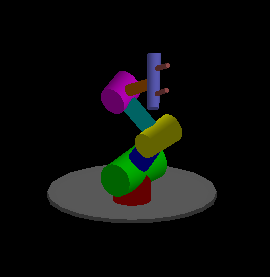

# OpenGL-Robot-Arm

This project simulates a multi-jointed robotic arm using OpenGL. It features hierarchical transformations, user interaction, and shading for a realistic 3D rendering of the arm's segments and joints.

## Features

- Real-time rendering using modern OpenGL
- Hierarchical model with multiple articulated joints:
  - Base rotation
  - Lower, middle, and upper arm segments
  - Wrist and finger control
- Lighting with ambient, diffuse, and specular components
- Interactive control via keyboard and mouse
- Dynamic view and projection manipulation

## File Structure

- `main.c`: Main rendering loop and application logic
- `initShader.h`: Utility for compiling and linking shaders
- `myLib.h`: Math utilities and matrix operations
- `vshader.glsl`: Vertex shader
- `fshader.glsl`: Fragment shader

## Controls

| Key              | Action                        |
|------------------|-------------------------------|
| Arrow Keys       | Rotate base                   |
| W / S            | Move lower joint              |
| A / D            | Move middle joint             |
| Q / E            | Move upper joint              |
| Z / X            | Rotate wrist                  |
| C / V            | Open/close fingers            |
| R                | Reset view and angles         |
| 1 / 2 / 3        | Toggle Phong lighting modes   |

## Dependencies

Make sure you have the following installed:

- OpenGL
- GLEW
- FreeGLUT (or GLUT on macOS)
